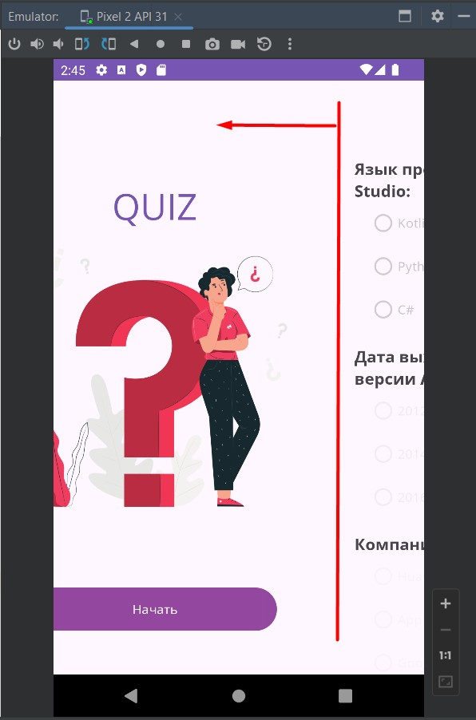
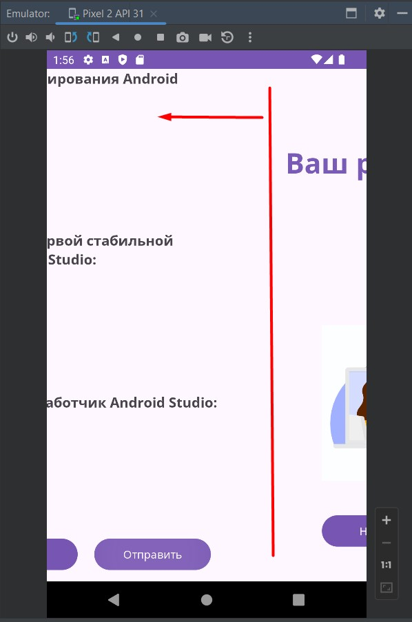
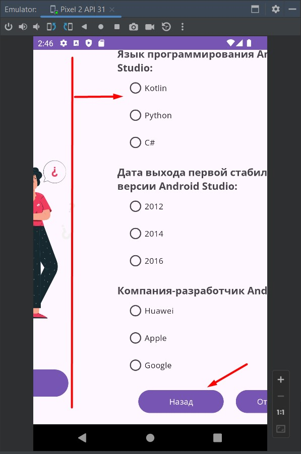
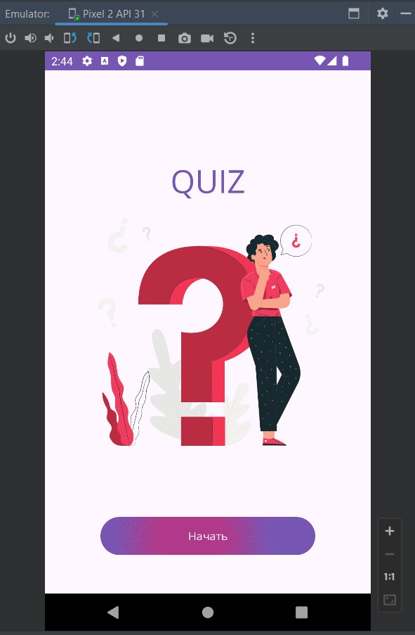
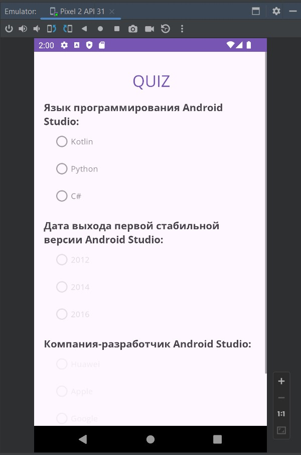
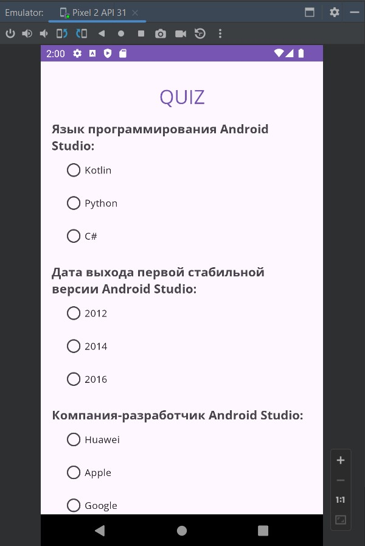
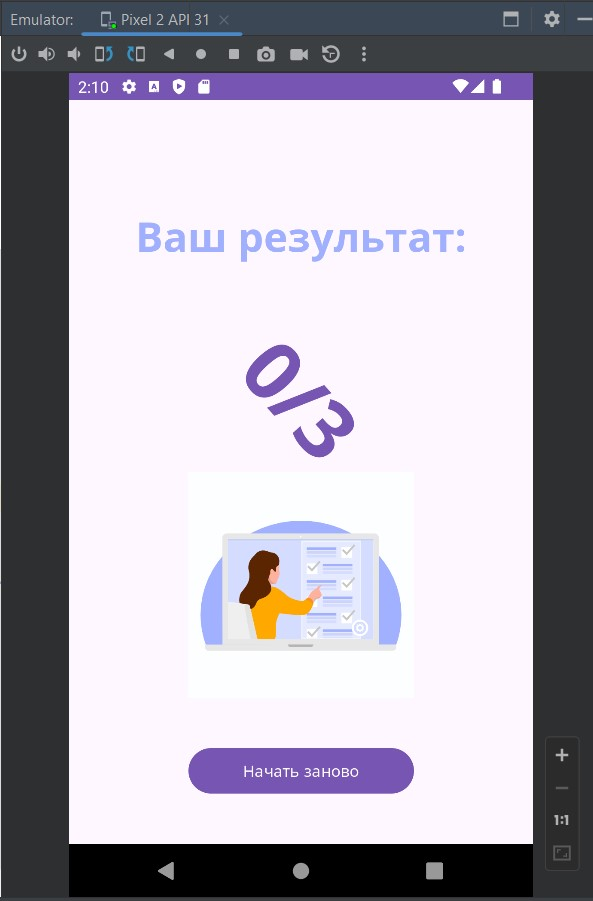
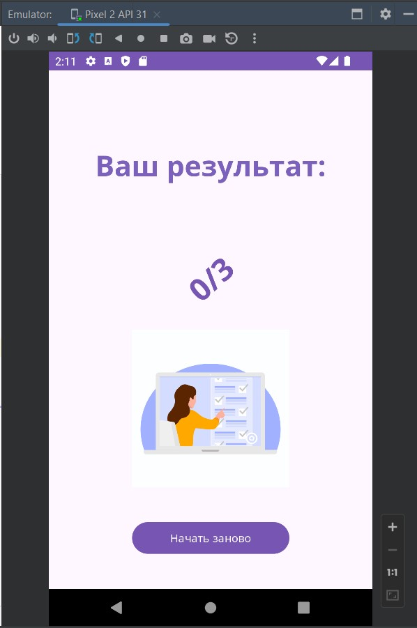
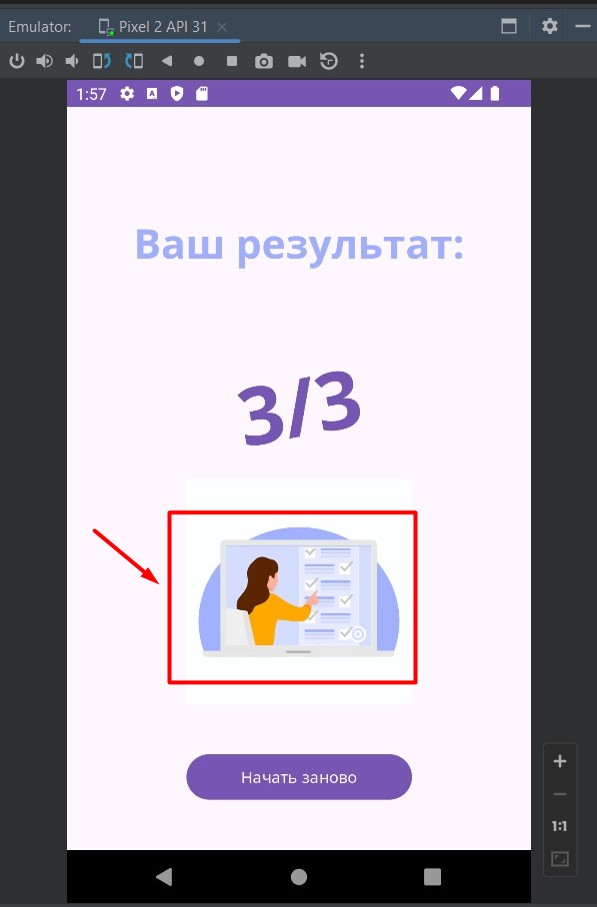

# Урок 8. Анимация

Цели практической работы

Потренировать знания:
• по созданию анимаций между компонентами;
• созданию анимаций для элементов экрана;
• использованию готовых анимаций.

Что нужно сделать:

Продолжите дорабатывать QUIZ-приложение, которое начали в предыдущих модулях. На этом этапе нужно 
добавить анимации переходов между фрагментами и анимации для элементов экрана.

Порядок действий:

## Задача №1.
Добавьте анимации переходов между фрагментами на экранах «Приветствие», «Опрос», «Результаты». 
Необходимо добавить минимум две собственные анимации и описать их в xml-файлах. Можете использовать 
любой фреймворк анимации (animator, animation, transition).

## Демонстрация решения:

------------------------------------------------------------------

## Задача №2.
Добавьте анимацию Ripple для кнопки «Начать» на экране «Приветствие».

## Демонстрация решения:

-------------------------------------------------------------------

## Задача №3.
Добавьте анимацию появления элементов (изменение прозрачности с 0 до 1) для любых элементов на экране «Опрос».

## Демонстрация решения:

 

------------------------------------------------------------------

## Задача №4.
Добавьте любую анимацию минимум для двух элементов на экране результатов при помощи objectAnimator 
(либо других animator классов). Можете использовать xml- либо kotlin-код для описания анимаций.

## Демонстрация решения:

-----------------------------------------------------------------

## Задача №5.
Добавьте любую готовую анимацию с помощью Lottie на экран «Результаты».

## Демонстрация решения:

===========================================================================
